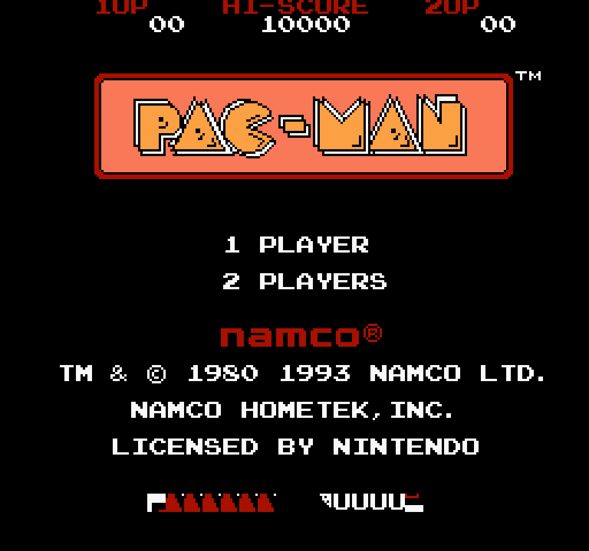
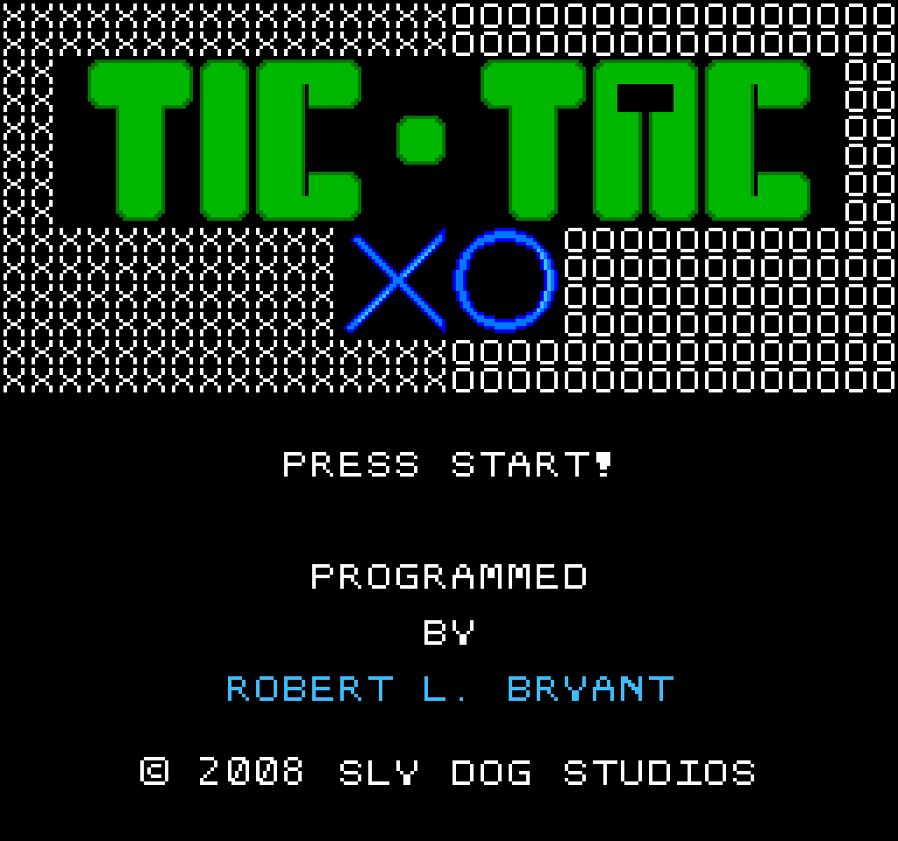

# NES-emu

A NES emulator in C, grown out of my own MOS 6502 CPU emulator
([emu-6502](https://github.com/KirolosBoshra/emu-6502)).

## Build

```
cmake -B build
cmake --build build
```

## Run

```
nes-emu.exe -g <game.nes> [-f frames] [--dump out.ppm]
```

Without `-f`, opens a raylib window and runs the game at ~60fps. With `-f`, runs `frames` frames headlessly; `--dump out.ppm` writes the final frame as a PPM image for headless inspection.

### Controls

| Key | Button |
| --- | --- |
| Arrows | D-pad |
| X / Z | A / B |
| Shift | Select |
| Enter | Start |

## Status

Implemented: full 6502 core (all 151 official opcodes, IRQ/NMI, cycle timing), iNES cartridge loader + NROM (mapper 0), PPU (registers, scroll/VRAM addressing, `$4014` OAM DMA, palette RAM, background + sprite rendering with h/v flips, vblank NMI), controllers (`$4016`/`$4017`, independent shift registers), raylib window with framebuffer blit.

Not yet: APU/audio, mappers 2/4 (UxROM/MMC3). ROMs requiring unsupported mappers are rejected with a clear error.

## Screenshots





## Dev

Throw a `.nes` ROM at it:

```sh
cmake --build build
# for rendering a frame to ppm image
./build/nes-emu.exe -g path/to/game.nes -f 30 --dump frame.ppm
# run the full game using Raylib backend
./build/nes-emu.exe -g path/to/game.nes
```
